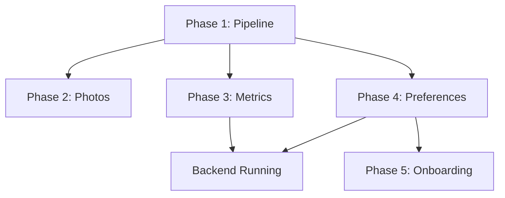

# Fix Priority and Strategy: The Right Order to Fix Everything

## Critical Insight

**THE MOST IMPORTANT DISCOVERY**: The fixes are already in the code, but they're not being deployed properly. This means we need to fix the deployment pipeline FIRST, then verify each fix is working.

## Priority Matrix

| Priority | Issue                  | Complexity | Dependencies       | User Impact       | Risk     |
| -------- | ---------------------- | ---------- | ------------------ | ----------------- | -------- |
| P0       | Build/Deploy Pipeline  | High       | None               | Blocks everything | Critical |
| P1       | Photo Selection        | Low        | None               | High              | Low      |
| P2       | Metrics Acknowledgment | Medium     | Backend API        | High              | Medium   |
| P3       | Dietary Preferences    | Medium     | Backend + Frontend | Medium            | Medium   |
| P4       | Onboarding Redirect    | Low        | Backend API        | Low               | Low      |

## Phase 1: Fix the Pipeline (P0 - MUST DO FIRST)

### Why This Is First

Without a working deployment pipeline, no fixes will reach users. We've proven the code fixes are correct but not deployed.

### Actions Required

```bash
#!/bin/bash
# fix_pipeline.sh

echo "=== Phase 1: Fixing Deployment Pipeline ==="

# Step 1: Create verification infrastructure
cat > verify_build.swift << 'EOF'
// Add to AppDelegate.swift or GTSDApp.swift
struct BuildVerification {
    static let version = "pipeline-fix-v1.0"
    static let timestamp = "2025-10-30T15:00:00Z"
    static let activeFixefix_pipeline.sh"

    static func verify() {
        print("🚀 BUILD VERIFICATION")
        print("🚀 Version: \(version)")
        print("🚀 Built: \(timestamp)")
        print("🚀 Fixes: \(activeFixes.joined(separator: ", "))")
    }
}

// Call on app launch
BuildVerification.verify()
EOF

# Step 2: Clean everything
rm -rf ~/Library/Developer/Xcode/DerivedData/*
rm -rf ~/Library/Caches/com.apple.dt.Xcode
xcrun simctl shutdown all
xcrun simctl erase all

# Step 3: Commit current state
git add -A
git commit -m "chore: Add build verification system"

# Step 4: Build fresh
xcodebuild clean -project apps/GTSD/GTSD.xcodeproj -scheme GTSD
xcodebuild build -project apps/GTSD/GTSD.xcodeproj -scheme GTSD

# Step 5: Verify deployment
xcrun simctl boot "iPhone 15 Pro"
xcrun simctl install booted ~/Library/Developer/Xcode/DerivedData/GTSD-*/Build/Products/Debug-iphonesimulator/GTSD.app
xcrun simctl launch booted com.gtsd.app --console | grep "BUILD VERIFICATION"
```

### Success Criteria

- [ ] Build verification appears in console logs
- [ ] Timestamp matches current build
- [ ] No uncommitted changes in git
- [ ] Fresh simulator with no cached data

## Phase 2: Fix Photo Selection (P1 - Easiest, No Dependencies)

### Why This Is Second

- Completely standalone issue
- Already identified the fix (remove `photoLibrary` parameter)
- Easy to verify success
- Builds user confidence

### Implementation

```swift
// File: ProfileEditView.swift
// Line: 98-101

// BEFORE (broken):
PhotosPicker(
    selection: $viewModel.selectedPhoto,
    matching: .images,
    photoLibrary: .shared()  // REMOVE THIS LINE
)

// AFTER (fixed):
PhotosPicker(
    selection: $viewModel.selectedPhoto,
    matching: .images
)

// ADD VERIFICATION:
.onAppear {
    print("🔧 FIX ACTIVE: photo-picker-no-library-v1.0")
}
```

### Testing Protocol

```bash
# 1. Clean install
xcrun simctl uninstall booted com.gtsd.app
xcodebuild install -project apps/GTSD/GTSD.xcodeproj -scheme GTSD

# 2. Test photo selection
# - Navigate to Profile > Edit
# - Tap "Change Photo"
# - Select any photo
# - Should load without "Unable to view" error

# 3. Verify in logs
xcrun simctl launch booted com.gtsd.app --console | grep "photo-picker"
```

### Success Criteria

- [ ] Photo picker opens
- [ ] Photos are visible
- [ ] Selected photo loads
- [ ] No "Unable to view" error
- [ ] Verification message in console

## Phase 3: Fix Metrics Acknowledgment (P2 - Backend Coordination)

### Why This Is Third

- Requires backend to be running
- Clear error message (400 Bad Request)
- Fix is already in code, needs verification

### Implementation

```swift
// File: MetricsSummaryViewModel.swift
// Line: 128

// Verify fix is present:
let response = try await metricsService.acknowledgeMetrics(
    version: metricsData.metrics.version,
    metricsComputedAt: metricsData.metrics.computedAtString  // Must be ISO8601 string
)

// ADD VERIFICATION:
print("🔧 FIX ACTIVE: metrics-iso8601-v1.0")
print("🔧 Sending computedAt as: \(metricsData.metrics.computedAtString)")
```

### Backend Verification First

```bash
# Test backend directly
curl -X POST http://localhost:3000/v1/profile/metrics/acknowledge \
  -H "Content-Type: application/json" \
  -H "Authorization: Bearer YOUR_TOKEN" \
  -d '{
    "version": 1,
    "metricsComputedAt": "2025-10-30T12:00:00.000Z"
  }'

# Should return 200 OK
```

### Testing Protocol

1. Complete onboarding flow
2. View metrics summary
3. Tap "Continue" or acknowledge button
4. Should not see 400 error
5. Check network tab for request format

### Success Criteria

- [ ] No 400 Bad Request error
- [ ] Network request shows ISO8601 timestamp
- [ ] Metrics marked as acknowledged
- [ ] User proceeds to next screen
- [ ] Verification messages in console

## Phase 4: Fix Dietary Preferences (P3 - Most Complex)

### Why This Is Fourth

- Depends on backend API changes
- Requires data persistence verification
- Multiple touchpoints (save + fetch)

### Implementation

Backend Fix (First):

```typescript
// File: apps/api/src/routes/auth/service.ts
// Line: 286-307

async getUserWithPreferences(userId: number) {
    // ... existing code ...

    return {
        ...user,
        dietaryPreferences: settings?.dietaryPreferences || [],
        allergies: settings?.allergies || [],
        mealsPerDay: settings?.mealsPerDay || 3,
        hasCompletedOnboarding: settings?.onboardingCompleted ?? false  // MUST BE PRESENT
    };
}
```

iOS Fix (Second):

```swift
// File: ProfileEditViewModel.swift
// Lines: 320-330

// After saving preferences:
Logger.info("Fetching fresh user data from backend")
let freshUser: User = try await apiClient.request(.currentUser)
print("🔧 FIX ACTIVE: preferences-refresh-v1.0")
print("🔧 Fresh user has \(freshUser.dietaryPreferences?.count ?? 0) preferences")
await authService.updateCurrentUser(freshUser)
await loadProfile()
```

### Testing Protocol

1. **Setup**

   ```bash
   # Ensure backend is running
   cd apps/api && npm run dev
   ```

2. **Test Flow**
   - Login as existing user
   - Go to Profile > Edit
   - Add/remove dietary preferences
   - Save changes
   - Preferences should persist
   - Kill app and relaunch
   - Preferences should still be there

3. **Verification**
   ```bash
   # Watch network requests
   mitmproxy -p 8888
   # Look for:
   # POST /auth/profile/preferences
   # GET /auth/me (should include preferences)
   ```

### Success Criteria

- [ ] Preferences save without error
- [ ] Fresh data fetched after save
- [ ] UI updates with new preferences
- [ ] Preferences persist after app restart
- [ ] hasCompletedOnboarding remains true

## Phase 5: Verify Onboarding Redirect (P4 - Should Be Fixed)

### Why This Is Last

- Lowest user impact (edge case)
- Should be fixed by Phase 4
- Easy to verify

### Verification Only

This should already be fixed by the dietary preferences fix, but verify:

```swift
// The fix ensures hasCompletedOnboarding is in response
// File: apps/api/src/routes/auth/service.ts

// Verify response includes:
{
    "hasCompletedOnboarding": true,
    "dietaryPreferences": [...],
    // ... other fields
}
```

### Testing Protocol

1. Complete onboarding as new user
2. Go to Profile > Edit
3. Change preferences
4. Save
5. Should NOT redirect to onboarding
6. Should stay in main app

### Success Criteria

- [ ] No unwanted redirects to onboarding
- [ ] hasCompletedOnboarding field present in API responses
- [ ] User stays in main app after profile edits

## Dependency Graph



## Risk Mitigation for Each Phase

### Phase 1 Risks (Pipeline)

**Risk**: Breaking the build system
**Mitigation**:

- Backup project.pbxproj first
- Use git branches for safety
- Test on separate machine if possible

### Phase 2 Risks (Photos)

**Risk**: Photos work in simulator but not device
**Mitigation**:

- Test on real device early
- Have fallback to image picker
- Add comprehensive error handling

### Phase 3 Risks (Metrics)

**Risk**: Backend API contract mismatch
**Mitigation**:

- Test backend with curl first
- Add request/response logging
- Have fallback error handling

### Phase 4 Risks (Preferences)

**Risk**: Data loss or corruption
**Mitigation**:

- Log all state changes
- Test with various preference combinations
- Ensure backward compatibility

### Phase 5 Risks (Onboarding)

**Risk**: Users stuck in redirect loop
**Mitigation**:

- Add escape hatch (skip button)
- Log all navigation decisions
- Test with various user states

## Rollback Plan

If any phase fails:

```bash
#!/bin/bash
# rollback.sh

echo "=== Rolling Back ==="

# 1. Stash current changes
git stash save "Failed attempt $(date)"

# 2. Return to last known good
git checkout main
git pull origin main

# 3. Clean everything
rm -rf ~/Library/Developer/Xcode/DerivedData/*
xcrun simctl erase all

# 4. Rebuild from clean
xcodebuild clean build -project apps/GTSD/GTSD.xcodeproj -scheme GTSD

echo "Rollback complete"
```

## Success Metrics

### Overall Success

- [ ] All P1-P4 issues resolved
- [ ] No regression in other features
- [ ] User can complete full flow without errors
- [ ] All fixes verified in production build

### Per-Phase Success

1. **Pipeline**: Build verification visible
2. **Photos**: Selection works first time
3. **Metrics**: No 400 errors
4. **Preferences**: Data persists
5. **Onboarding**: No unwanted redirects

## Timeline Estimate

| Phase                 | Duration    | Notes                   |
| --------------------- | ----------- | ----------------------- |
| Phase 1 (Pipeline)    | 1 hour      | Critical foundation     |
| Phase 2 (Photos)      | 30 mins     | Simple fix              |
| Phase 3 (Metrics)     | 1 hour      | Backend coordination    |
| Phase 4 (Preferences) | 2 hours     | Most complex            |
| Phase 5 (Onboarding)  | 30 mins     | Verification only       |
| **Total**             | **5 hours** | With proper methodology |

## The Most Important Rule

**DO NOT SKIP PHASE 1**

Without a working deployment pipeline, you're debugging ghosts. Fix the pipeline first, then everything else becomes straightforward.

## Quick Reference Card

```bash
# Phase 1: Fix Pipeline
./fix_pipeline.sh

# Phase 2: Fix Photos
# Remove: photoLibrary: .shared()

# Phase 3: Fix Metrics
# Ensure: metricsComputedAt is ISO8601 string

# Phase 4: Fix Preferences
# Add: Fetch fresh user data after save

# Phase 5: Verify Onboarding
# Check: hasCompletedOnboarding in responses
```

Remember: The fixes are already written. We just need to deploy them properly.
