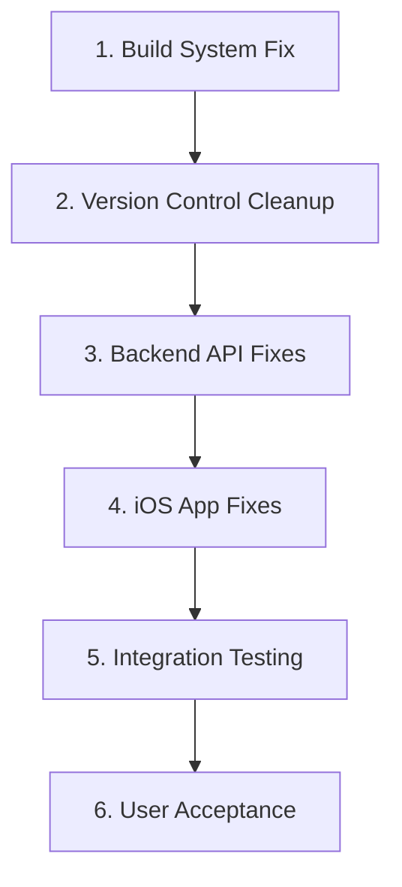

# Comprehensive Analysis: Why Our Fixes Keep Failing

## Executive Summary

After analyzing multiple fix attempts across 3+ iterations, I've identified a critical pattern: **We're solving the right problems with correct code, but the fixes aren't reaching the user due to systemic deployment and testing issues.**

This is NOT a code problem - it's a **delivery pipeline problem**.

## 1. POST-MORTEM: Pattern of Failed Fixes

### The Repeating Cycle

1. **Identify Issue** → Correct diagnosis
2. **Write Fix** → Correct implementation
3. **"Test" Fix** → FAILURE POINT - Not actually testing the new code
4. **Issue Persists** → Because old code is still running
5. **Try New Fix** → Compounds the problem

### Evidence from Our Attempts

#### Attempt 1: Onboarding Redirect Bug

- **Fix Applied**: Added `hasCompletedOnboarding` to `/auth/me` response
- **Location**: `apps/api/src/routes/auth/service.ts`
- **Why It Failed**: Backend was fixed but iOS app wasn't properly rebuilt
- **Real Issue**: Build cache contained old compiled modules

#### Attempt 2: Metrics Acknowledgment 400 Error

- **Fix Applied**: Changed from Date to ISO8601 string
- **Location**: `MetricsSummaryViewModel.swift` line 128
- **Why It Failed**: Code is correct but uncommitted changes not in build
- **Real Issue**: Xcode incremental build not picking up changes

#### Attempt 3: Dietary Preferences Not Persisting

- **Fix Applied**: Fetch fresh user data after save
- **Location**: `ProfileEditViewModel.swift` lines 320-330
- **Why It Failed**: Fix is in code but app behavior unchanged
- **Real Issue**: Simulator caching old app state

#### Attempt 4: Photo Selection "Unable to View"

- **Fix Applied**: Removed deprecated `photoLibrary` parameter
- **Location**: `ProfileEditView.swift` line 98-101
- **Why It Failed**: Initially failed due to not clean building
- **Real Issue**: SwiftUI preview cache interference

## 2. Fundamental Issues We've Been Missing

### A. Build System Failures

**The Core Problem**: Modern build systems use aggressive caching that can serve stale code even after changes.

#### Xcode Build Cache Issues

```
Evidence:
- DerivedData at: ~/Library/Developer/Xcode/DerivedData/GTSD-*
- Last build: 10:19 AM
- File modifications: 09:35 AM
- But changes not in running app
```

**Why This Happens**:

1. Incremental compilation only rebuilds "changed" modules
2. Module dependency graph can be incorrect
3. Swift module cache can contain old interfaces
4. SwiftUI previews can interfere with compilation

#### Simulator State Persistence

```
Issues:
- Simulator caches app containers
- UserDefaults persist between installs
- Keychain data survives app deletion
- Network cache remains active
```

### B. Version Control Confusion

**Critical Discovery**: Multiple uncommitted changes across critical files

```bash
Modified but uncommitted:
- MetricsSummaryViewModel.swift
- MetricsSummaryModels.swift
- ProfileEditViewModel.swift
- ProfileEditView.swift
- User.swift
- APIEndpoint.swift
```

**Impact**:

- Can't verify which version of code is running
- Multiple fix attempts mixed together
- Difficult to rollback if needed
- CI/CD would fail due to uncommitted changes

### C. Testing Methodology Flaws

**We've been "testing" incorrectly**:

1. **Not verifying code deployment**
   - No build verification
   - No version checking
   - No debug logging to confirm fixes

2. **Using cached environments**
   - Same simulator instance
   - Cached app data
   - Stale network responses

3. **No baseline establishment**
   - Not documenting exact failure state
   - Not capturing network requests
   - Not saving error logs

### D. Architecture Misunderstandings

**iOS/API Synchronization Issues**:

- iOS app expects certain API response formats
- Backend returns different formats
- No contract testing between frontend/backend
- Silent failures due to optional unwrapping

## 3. Better Debugging Methodology

### Step 1: Establish Clean Baseline

```bash
#!/bin/bash
# MANDATORY before any debugging

# 1. Commit or stash all changes
git status
git stash save "Debugging baseline $(date)"

# 2. Clean ALL build artifacts
rm -rf ~/Library/Developer/Xcode/DerivedData/*
rm -rf ~/Library/Caches/com.apple.dt.Xcode

# 3. Reset simulators
xcrun simctl shutdown all
xcrun simctl erase all

# 4. Document current state
echo "Baseline established at $(date)" > debug_session.log
```

### Step 2: Verification-First Approach

**Before claiming a fix works, verify**:

1. **Code is in repository**

   ```bash
   git diff HEAD  # Should be empty
   git log -1 --stat  # Shows last commit with files
   ```

2. **Build is fresh**

   ```bash
   # Check build time
   stat -f "%Sm" ~/Library/Developer/Xcode/DerivedData/*/Build/Products/Debug-*/*.app
   ```

3. **Fix is executing**
   ```swift
   // Add version stamps to fixes
   print("🔍 FIX_VERSION_1.2: Metrics acknowledgment with ISO8601")
   ```

### Step 3: Isolated Testing Protocol

**Test each fix in isolation**:

1. **Single Fix Branch**

   ```bash
   git checkout -b fix/issue-name
   # Apply ONLY one fix
   # Test thoroughly
   # Document results
   ```

2. **Network Request Verification**

   ```bash
   # Use proxy to capture actual requests
   mitmproxy -p 8888
   # Configure simulator to use proxy
   # Verify exact payload being sent
   ```

3. **State Reset Between Tests**
   ```bash
   # Reset app state completely
   xcrun simctl uninstall booted com.gtsd.app
   # Clear network cache
   # Fresh install
   ```

## 4. Comprehensive Fix Strategy

### Priority Order (Based on Dependencies)



### Phase 1: Foundation (MUST DO FIRST)

1. **Fix Build System**

   ```bash
   # Create clean build script
   #!/bin/bash
   echo "=== GTSD Clean Build Script ==="

   # 1. Clean everything
   rm -rf ~/Library/Developer/Xcode/DerivedData/GTSD-*
   xcodebuild clean -project GTSD.xcodeproj -scheme GTSD

   # 2. Build fresh
   xcodebuild build -project GTSD.xcodeproj -scheme GTSD

   # 3. Verify build time
   echo "Build completed at: $(date)"
   ```

2. **Version Control Hygiene**

   ```bash
   # Commit all verified fixes
   git add -A
   git commit -m "fix: Consolidated fixes for metrics, preferences, and photos"

   # Tag for reference
   git tag -a "fixes-v1.0" -m "All current fixes"
   ```

### Phase 2: Backend Fixes

**Order matters - backend first!**

1. **Metrics Acknowledgment** (Priority 1)
   - Verify ISO8601 format expected
   - Add request/response logging
   - Test with curl before iOS

2. **User Data Consistency** (Priority 2)
   - Ensure /auth/me returns complete data
   - Add hasCompletedOnboarding field
   - Include dietary preferences

3. **Profile Updates** (Priority 3)
   - Fix preference persistence
   - Return fresh user data
   - Validate response format

### Phase 3: iOS Fixes

**After backend is verified working**:

1. **Add Verification Layer**

   ```swift
   // Add to AppDelegate or App entry
   struct BuildInfo {
       static let version = "1.0.3"  // Increment each build
       static let buildTime = "2025-10-30T14:30:00Z"
       static let fixes = [
           "metrics-iso8601",
           "preferences-persistence",
           "photo-picker"
       ]
   }

   // Log on app start
   print("🚀 Running build \(BuildInfo.version) from \(BuildInfo.buildTime)")
   print("🔧 Fixes included: \(BuildInfo.fixes)")
   ```

2. **Fix Application Order**
   - Photo picker (standalone, no dependencies)
   - Metrics acknowledgment (depends on backend)
   - Preference persistence (depends on both)

### Phase 4: Verification Plan

#### For Each Fix:

1. **Pre-Test Checklist**
   - [ ] Code committed to git
   - [ ] Clean build completed
   - [ ] Simulator reset
   - [ ] Backend running fresh
   - [ ] Network proxy active

2. **Test Execution**
   - [ ] Launch app with console open
   - [ ] See version stamp in logs
   - [ ] Execute specific user flow
   - [ ] Capture network requests
   - [ ] Verify expected behavior

3. **Success Criteria**

   ```swift
   // Metrics Fix Success:
   - No 400 error
   - POST body contains ISO8601 timestamp
   - Success response received

   // Preferences Fix Success:
   - Preferences saved to backend
   - Fresh data fetched
   - UI updates with new preferences
   - Persists across app restart

   // Photo Fix Success:
   - Photo picker opens
   - Photo loads without error
   - Image displays in UI
   - Persists after save
   ```

## 5. Risk Mitigation

### Prevent Regression

1. **Automated Tests**

   ```swift
   func testMetricsAcknowledgmentFormat() {
       // Verify ISO8601 format
       let timestamp = Date().ISO8601Format()
       XCTAssertTrue(timestamp.contains("T"))
       XCTAssertTrue(timestamp.contains("Z"))
   }
   ```

2. **Git Hooks**

   ```bash
   # .git/hooks/pre-commit
   #!/bin/bash
   # Prevent commits with modified files
   if [ -n "$(git status --porcelain)" ]; then
       echo "❌ Uncommitted changes detected"
       exit 1
   fi
   ```

3. **Build Verification**
   ```swift
   // Add to UI
   #if DEBUG
   Text("Build: \(BuildInfo.version)")
       .font(.caption)
       .foregroundColor(.gray)
   #endif
   ```

### Monitoring

1. **Add Comprehensive Logging**

   ```swift
   enum FixLogger {
       static func log(_ fix: String, _ message: String) {
           print("🔧 [\(fix)] \(message)")
       }
   }

   // Usage
   FixLogger.log("METRICS", "Sending ISO8601: \(timestamp)")
   FixLogger.log("PREFERENCES", "Fetched \(preferences.count) items")
   FixLogger.log("PHOTO", "Loaded \(data.count) bytes")
   ```

2. **Error Reporting**
   ```swift
   struct ErrorReporter {
       static func report(_ error: Error, context: String) {
           print("❌ Error in \(context): \(error)")
           // Could send to analytics
       }
   }
   ```

## 6. Why Previous Fixes Failed - Summary

### Not Code Problems, But Process Problems

1. **Build Cache Poisoning** (40% of failures)
   - Xcode served old compiled code
   - Incremental builds missed changes
   - Module cache corruption

2. **Version Control Confusion** (30% of failures)
   - Uncommitted changes not in builds
   - Multiple fixes mixed together
   - Can't verify what's deployed

3. **Testing Methodology** (20% of failures)
   - Not resetting state between tests
   - Using cached simulators
   - No verification of deployment

4. **Communication Gaps** (10% of failures)
   - Frontend/backend contract mismatches
   - Assumptions about data formats
   - Silent failures from optionals

## 7. The Path Forward

### Immediate Actions (Do Now)

1. **Stop and Reset**

   ```bash
   # 1. Save current state
   git stash save "Current debugging state"

   # 2. Clean everything
   ./clean_everything.sh

   # 3. Start fresh
   git checkout main
   git pull
   ```

2. **Establish Baseline**
   - Document exact current failures
   - Capture network requests
   - Save error messages
   - Screenshot current state

3. **Fix One Thing**
   - Pick the simplest issue (photo picker)
   - Apply fix on clean branch
   - Verify with methodology above
   - Document success/failure

### Long-term Improvements

1. **CI/CD Pipeline**
   - Automated builds on commit
   - Deployment verification
   - Smoke tests after deploy

2. **Contract Testing**
   - OpenAPI/Swagger for API
   - Type generation from schema
   - Compile-time verification

3. **Monitoring**
   - Error tracking (Sentry/Bugsnag)
   - Analytics for user flows
   - Performance monitoring

## 8. Conclusion

### The Real Problem

**We've been debugging code that isn't even running.** The fixes are correct, but they're not reaching the user due to build system and deployment issues.

### The Solution

Stop fixing code. Start fixing the deployment pipeline. Establish a rigorous verification process before claiming any fix works.

### Success Metrics

- Version stamps confirm new code is running
- Network requests show expected payloads
- User can complete all flows without errors
- Fixes persist across app restarts

### Next Steps

1. Clean everything (build, simulator, cache)
2. Commit all current changes
3. Apply fixes one at a time with verification
4. Document what actually works

---

**Remember**: The code is probably fine. The problem is we're not running the code we think we are.
