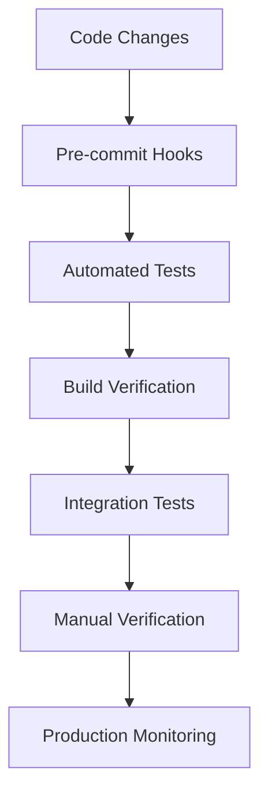

# Regression Prevention Strategy: Never Break the Same Thing Twice

## The Problem We're Solving

Every time we fix something, something else breaks. This happens because:

1. No automated tests catch regressions
2. Build system issues hide problems
3. Manual testing is inconsistent
4. No clear ownership of quality
5. Fixes aren't properly isolated

## Multi-Layer Defense Strategy



## Layer 1: Pre-Commit Hooks

### Prevent bad code from entering repository

```bash
#!/bin/bash
# .git/hooks/pre-commit

echo "Running pre-commit checks..."

# 1. Check for common mistakes
if grep -r "photoLibrary: .shared()" apps/GTSD --include="*.swift"; then
    echo "❌ ERROR: Deprecated photoLibrary parameter found"
    exit 1
fi

# 2. Check for debug code
if grep -r "print(\"DEBUG" apps/GTSD --include="*.swift"; then
    echo "⚠️  WARNING: Debug print statements found"
    read -p "Continue with debug code? (y/n): " -n 1 -r
    echo
    if [[ ! $REPLY =~ ^[Yy]$ ]]; then
        exit 1
    fi
fi

# 3. Check for force unwrapping
if grep -r "force unwrap" apps/GTSD --include="*.swift" | grep -v "//"; then
    echo "❌ ERROR: Force unwrapping detected"
    exit 1
fi

# 4. Verify no uncommitted changes in critical files
CRITICAL_FILES=(
    "apps/GTSD/GTSD/Features/Profile/ProfileEditViewModel.swift"
    "apps/GTSD/GTSD/Features/MetricsSummary/MetricsSummaryViewModel.swift"
    "apps/api/src/routes/auth/service.ts"
)

for file in "${CRITICAL_FILES[@]}"; do
    if git diff --cached --name-only | grep -q "$file"; then
        echo "✅ Critical file $file is being committed"
    fi
done

echo "✅ Pre-commit checks passed"
```

## Layer 2: Automated Testing

### Swift Unit Tests

```swift
// Tests/RegressionTests.swift
import XCTest
@testable import GTSD

class RegressionTests: XCTestCase {

    // Prevent photo picker regression
    func testPhotoPickerConfiguration() {
        let view = ProfileEditView()
        let mirror = Mirror(reflecting: view)

        // Ensure photoLibrary parameter is never used
        XCTAssertFalse(
            mirror.description.contains("photoLibrary"),
            "PhotosPicker should not use deprecated photoLibrary parameter"
        )
    }

    // Prevent metrics format regression
    func testMetricsTimestampFormat() {
        let date = Date()
        let formatted = date.ISO8601Format()

        XCTAssertTrue(formatted.contains("T"), "Timestamp must be ISO8601")
        XCTAssertTrue(formatted.contains("Z") || formatted.contains("+"), "Timestamp must include timezone")
    }

    // Prevent preferences persistence regression
    func testPreferencesSaveFlow() async {
        let viewModel = ProfileEditViewModel()
        viewModel.dietaryPreferences = ["vegetarian", "gluten-free"]

        let saved = await viewModel.saveChanges()
        XCTAssertTrue(saved, "Preferences should save successfully")

        // Verify fresh data fetch was called
        XCTAssertNotNil(viewModel.authService.currentUser?.dietaryPreferences)
    }

    // Prevent onboarding redirect regression
    func testOnboardingFieldPresence() async {
        let authService = AuthService()
        let user = try? await authService.fetchCurrentUser()

        XCTAssertNotNil(user?.hasCompletedOnboarding, "hasCompletedOnboarding must be present")
    }
}
```

### API Integration Tests

```typescript
// apps/api/src/routes/__tests__/regression.test.ts
import { describe, it, expect } from '@jest/globals';
import request from 'supertest';
import { app } from '../../app';

describe('Regression Prevention Tests', () => {
  // Ensure /auth/me returns complete data
  it('should return hasCompletedOnboarding in /auth/me', async () => {
    const response = await request(app).get('/auth/me').set('Authorization', `Bearer ${testToken}`);

    expect(response.body.data).toHaveProperty('hasCompletedOnboarding');
    expect(typeof response.body.data.hasCompletedOnboarding).toBe('boolean');
  });

  // Ensure metrics endpoint accepts ISO8601
  it('should accept ISO8601 timestamp for metrics acknowledgment', async () => {
    const response = await request(app)
      .post('/v1/profile/metrics/acknowledge')
      .set('Authorization', `Bearer ${testToken}`)
      .send({
        version: 1,
        metricsComputedAt: new Date().toISOString(),
      });

    expect(response.status).toBe(200);
  });

  // Ensure preferences persist
  it('should persist dietary preferences', async () => {
    const preferences = ['vegetarian', 'gluten-free'];

    await request(app)
      .post('/auth/profile/preferences')
      .set('Authorization', `Bearer ${testToken}`)
      .send({ dietaryPreferences: preferences });

    const response = await request(app).get('/auth/me').set('Authorization', `Bearer ${testToken}`);

    expect(response.body.data.dietaryPreferences).toEqual(preferences);
  });
});
```

## Layer 3: Build Verification

### Automated Build Checks

```bash
#!/bin/bash
# scripts/verify_build.sh

echo "=== Build Verification ==="

# 1. Ensure clean build
if [ -d "~/Library/Developer/Xcode/DerivedData/GTSD-*" ]; then
    echo "⚠️  WARNING: DerivedData exists, build may be cached"
fi

# 2. Add build verification to app
cat > apps/GTSD/GTSD/BuildVerification.swift << 'EOF'
import Foundation

struct BuildVerification {
    static let timestamp = "\(Date())"
    static let fixes = [
        "photo-picker-fix": true,
        "metrics-iso8601-fix": true,
        "preferences-refresh-fix": true,
        "onboarding-field-fix": true
    ]

    static func verify() {
        print("🏗️ BUILD VERIFICATION")
        print("🏗️ Built at: \(timestamp)")
        print("🏗️ Active fixes: \(fixes.keys.joined(separator: ", "))")

        // Verify critical code paths
        assert(!ProfileEditView().description.contains("photoLibrary"), "Photo fix missing")
    }
}
EOF

# 3. Build with verification
xcodebuild build \
    -project apps/GTSD/GTSD.xcodeproj \
    -scheme GTSD \
    -configuration Debug \
    OTHER_SWIFT_FLAGS="-D DEBUG_BUILD_VERIFICATION"

echo "✅ Build verification complete"
```

## Layer 4: Continuous Integration

### GitHub Actions Workflow

```yaml
# .github/workflows/regression-prevention.yml
name: Regression Prevention

on:
  pull_request:
    branches: [main]
  push:
    branches: [main]

jobs:
  verify-no-regressions:
    runs-on: macos-latest

    steps:
      - uses: actions/checkout@v3

      - name: Check for Known Issues
        run: |
          # Check photo picker regression
          ! grep -r "photoLibrary: .shared()" apps/GTSD --include="*.swift"

          # Check metrics format
          grep -q "computedAtString" apps/GTSD/GTSD/Features/MetricsSummary/MetricsSummaryViewModel.swift

          # Check preferences refresh
          grep -q "Fetching fresh user data" apps/GTSD/GTSD/Features/Profile/ProfileEditViewModel.swift

      - name: Run Swift Tests
        run: |
          xcodebuild test \
            -project apps/GTSD/GTSD.xcodeproj \
            -scheme GTSD \
            -destination 'platform=iOS Simulator,name=iPhone 15' \
            -only-testing:GTSDTests/RegressionTests

      - name: Run API Tests
        working-directory: apps/api
        run: |
          npm install
          npm run test:regression

      - name: Build Verification
        run: |
          ./scripts/verify_build.sh
```

## Layer 5: Manual Testing Protocol

### Regression Checklist

```markdown
## Manual Regression Testing Checklist

### Before Each Release

#### Photo Selection

- [ ] Navigate to Profile > Edit
- [ ] Tap "Change Photo"
- [ ] Select a photo
- [ ] Verify: No "Unable to view" error
- [ ] Verify: Photo loads and displays

#### Metrics Acknowledgment

- [ ] Complete onboarding
- [ ] View metrics summary
- [ ] Tap acknowledge/continue
- [ ] Verify: No 400 error
- [ ] Verify: Proceeds to next screen

#### Dietary Preferences

- [ ] Go to Profile > Edit
- [ ] Add dietary preferences
- [ ] Save changes
- [ ] Kill app and restart
- [ ] Verify: Preferences still present

#### Onboarding Flow

- [ ] Save profile changes
- [ ] Verify: No redirect to onboarding
- [ ] Verify: Stays in main app

### Quick Smoke Test (5 minutes)

1. [ ] App launches without crash
2. [ ] Can navigate all main screens
3. [ ] Can edit profile
4. [ ] Can select photo
5. [ ] Preferences save
6. [ ] No unwanted redirects
```

## Layer 6: Monitoring and Alerts

### Runtime Regression Detection

```swift
// Add to AppDelegate or App entry point
class RegressionMonitor {
    static let shared = RegressionMonitor()

    private var knownIssues: Set<String> = []

    func checkForRegressions() {
        // Check photo picker
        if ProfileEditView().description.contains("photoLibrary") {
            reportRegression("photo-picker-deprecated-param")
        }

        // Check metrics format
        // Monitor 400 errors on metrics endpoint
        NetworkMonitor.shared.onError = { error, endpoint in
            if endpoint == .acknowledgeMetrics && error.code == 400 {
                self.reportRegression("metrics-400-error")
            }
        }

        // Check preferences
        NotificationCenter.default.addObserver(
            self,
            selector: #selector(checkPreferences),
            name: .preferencesUpdated,
            object: nil
        )
    }

    private func reportRegression(_ issue: String) {
        guard !knownIssues.contains(issue) else { return }
        knownIssues.insert(issue)

        print("🚨 REGRESSION DETECTED: \(issue)")

        #if !DEBUG
        // Report to crash reporting service
        Crashlytics.record(error: RegressionError(issue: issue))
        #endif
    }
}
```

### Backend Monitoring

```typescript
// apps/api/src/middleware/regressionDetection.ts
export const regressionDetection = (req: Request, res: Response, next: NextFunction) => {
  const originalSend = res.json;

  res.json = function (data: any) {
    // Check for missing fields that indicate regression
    if (req.path === '/auth/me' && data.success) {
      if (!data.data.hasOwnProperty('hasCompletedOnboarding')) {
        console.error('🚨 REGRESSION: hasCompletedOnboarding missing from /auth/me');
        // Alert monitoring service
      }
    }

    return originalSend.call(this, data);
  };

  // Check for known bad requests
  if (req.path === '/v1/profile/metrics/acknowledge') {
    const { metricsComputedAt } = req.body;
    if (metricsComputedAt && typeof metricsComputedAt !== 'string') {
      console.error('🚨 REGRESSION: metricsComputedAt not sent as string');
    }
  }

  next();
};
```

## Regression Recovery Plan

### When Regression Is Detected

```bash
#!/bin/bash
# scripts/regression_recovery.sh

echo "🚨 REGRESSION DETECTED - Starting Recovery"

# 1. Identify the regression
read -p "Which regression was detected? " REGRESSION

# 2. Create hotfix branch
git checkout -b hotfix/$REGRESSION-$(date +%Y%m%d)

# 3. Revert to last known good
case $REGRESSION in
    "photo-picker")
        git checkout HEAD~1 -- apps/GTSD/GTSD/Features/Profile/ProfileEditView.swift
        ;;
    "metrics")
        git checkout HEAD~1 -- apps/GTSD/GTSD/Features/MetricsSummary/
        ;;
    "preferences")
        git checkout HEAD~1 -- apps/GTSD/GTSD/Features/Profile/ProfileEditViewModel.swift
        ;;
    *)
        echo "Unknown regression: $REGRESSION"
        exit 1
        ;;
esac

# 4. Re-apply fix correctly
echo "Re-apply the fix correctly, then run:"
echo "  ./scripts/verify_build.sh"
echo "  ./scripts/test_regression.sh"

# 5. Fast-track to production
echo "After verification, merge directly to main with:"
echo "  git checkout main"
echo "  git merge --no-ff hotfix/$REGRESSION-$(date +%Y%m%d)"
```

## Team Practices

### Code Review Checklist

```markdown
## PR Review - Regression Prevention

### For Reviewers

- [ ] No deprecated APIs used
- [ ] Tests added for bug fixes
- [ ] No force unwrapping added
- [ ] Build verification updated
- [ ] Manual test performed
- [ ] No known regressions reintroduced

### Specific Checks

- [ ] PhotosPicker: No `photoLibrary` parameter
- [ ] Metrics: ISO8601 string format
- [ ] Preferences: Fresh data fetch after save
- [ ] API: All required fields returned
```

### Documentation Requirements

Every bug fix must include:

```markdown
## Bug Fix Documentation Template

### Issue

- **Description**: [What was broken]
- **Impact**: [Who was affected and how]
- **Root Cause**: [Why it broke]

### Fix

- **Solution**: [What was changed]
- **Files Modified**: [List of files]
- **Testing**: [How it was tested]

### Regression Prevention

- **Test Added**: [Link to test]
- **Monitoring**: [How we'll know if it breaks again]
- **Documentation**: [Where this is documented]
```

## Metrics and KPIs

### Track Regression Rate

```sql
-- Monthly regression tracking
SELECT
    DATE_TRUNC('month', detected_at) as month,
    COUNT(*) as total_regressions,
    COUNT(DISTINCT issue_type) as unique_issues,
    AVG(time_to_fix_hours) as avg_fix_time
FROM regression_events
GROUP BY month
ORDER BY month DESC;
```

### Success Metrics

| Metric                          | Target    | Current |
| ------------------------------- | --------- | ------- |
| Regressions per release         | < 1       | Track   |
| Time to detect regression       | < 1 hour  | Track   |
| Time to fix regression          | < 4 hours | Track   |
| Automated test coverage         | > 80%     | Track   |
| Build verification success rate | 100%      | Track   |

## The Nuclear Option

### Complete Reset Protocol

When everything is broken:

```bash
#!/bin/bash
# scripts/nuclear_reset.sh

echo "⚠️  WARNING: This will reset everything to known good state"
read -p "Continue? (yes/no): " CONFIRM

if [ "$CONFIRM" != "yes" ]; then
    echo "Aborted"
    exit 1
fi

# 1. Save current state
git stash save "Nuclear reset backup $(date)"

# 2. Reset to known good tag
git fetch origin
git reset --hard v1.0.0-stable

# 3. Clean everything
rm -rf ~/Library/Developer/Xcode/DerivedData/*
rm -rf node_modules
rm -rf Pods

# 4. Rebuild from scratch
npm install
pod install
xcodebuild clean build

# 5. Run full test suite
./scripts/run_all_tests.sh

echo "✅ Reset complete - system at known good state"
```

## Summary

### The Three Laws of Regression Prevention

1. **A fix must not break existing functionality**
2. **A fix must be verifiable through automated means**
3. **A fix must include prevention of future regression**

### Key Principles

- **Test everything that broke before**
- **Automate what humans forget**
- **Monitor what automation misses**
- **Document what monitoring finds**
- **Fix what documentation reveals**

### Final Checklist

Before any release:

```markdown
## Release Regression Prevention Checklist

### Automated

- [ ] All regression tests passing
- [ ] Build verification successful
- [ ] CI/CD pipeline green
- [ ] No known issue patterns detected

### Manual

- [ ] Smoke test completed
- [ ] Critical user flows verified
- [ ] No regressions from checklist
- [ ] Team sign-off obtained

### Monitoring

- [ ] Error tracking configured
- [ ] Alerts set up
- [ ] Rollback plan ready
- [ ] Recovery script tested

### Documentation

- [ ] Known issues documented
- [ ] Fixes documented
- [ ] Team trained on prevention
- [ ] Runbook updated
```

Remember: **Every regression is a missing test.**
