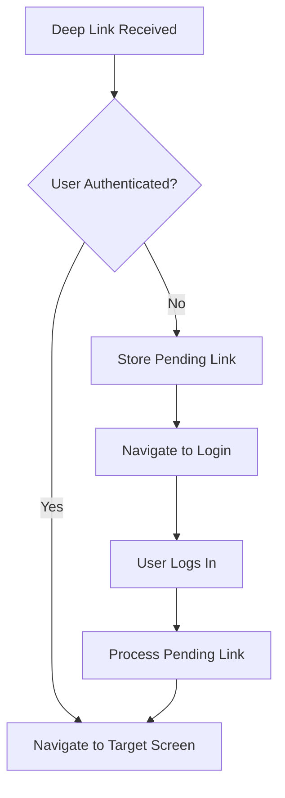

# Deep Linking Documentation

## Overview

GTSD mobile app supports deep linking to allow users to navigate directly to specific screens from external sources like SMS messages, emails, or other apps. The implementation includes authentication-aware routing, ensuring users are properly authenticated before accessing protected screens.

## Architecture

### Components

1. **App.tsx** - Configures React Navigation linking with URL prefixes and path mappings
2. **DeepLinkHandler.tsx** - Manages auth-aware routing and pending deep links
3. **authStore.ts** - Manages authentication state and pending deep links
4. **TodayScreen.tsx** - Enhanced to handle deep link parameters

### Flow



## Supported URL Patterns

### Basic Navigation

| URL Pattern | Description | Parameters |
|------------|-------------|------------|
| `gtsd://today` | Opens Today screen | None |
| `gtsd://today?reminder=pending` | Opens Today with pending tasks alert | `reminder`: 'pending' or 'overdue' |
| `gtsd://today?scrollToTask=true` | Opens Today and scrolls to first task | `scrollToTask`: boolean |
| `gtsd://task/:id` | Opens specific task detail | `id`: task ID (number) |
| `gtsd://settings` | Opens Settings screen | None |

### Onboarding Screens

| URL Pattern | Description |
|------------|-------------|
| `gtsd://welcome` | Opens Welcome screen |
| `gtsd://onboarding/goals` | Opens Goals onboarding |
| `gtsd://onboarding/health` | Opens Health Metrics screen |
| `gtsd://onboarding/activity` | Opens Activity Level screen |

### Universal Links (Optional)

The app also supports universal links for web URLs:
- `https://gtsd.app/today`
- `https://www.gtsd.app/today`

## Implementation Details

### Authentication Handling

The deep linking system is authentication-aware:

1. **Authenticated Users**: Navigate directly to the requested screen
2. **Unauthenticated Users**:
   - Deep link is stored in auth store
   - User is redirected to Welcome/Login screen
   - After successful authentication, the pending deep link is processed
   - User is navigated to the originally requested screen

### App States Handling

Deep links work correctly in all app states:

- **Cold Start**: App is completely closed
- **Warm Start**: App is in background
- **Foreground**: App is currently active

## Testing Deep Links

### Using CLI Tools

#### iOS Simulator
```bash
# Basic deep link
npx uri-scheme open "gtsd://today" --ios

# With parameters
npx uri-scheme open "gtsd://today?reminder=pending" --ios

# Task detail
npx uri-scheme open "gtsd://task/123" --ios
```

#### Android Emulator
```bash
# Basic deep link
npx uri-scheme open "gtsd://today" --android

# Using ADB directly
adb shell am start -W -a android.intent.action.VIEW -d "gtsd://today" com.gtsd
```

### In Development

The app includes a `DeepLinkTester` utility for development testing:

```javascript
// In React Native Debugger console:
DeepLinkTester.showTestMenu()
DeepLinkTester.testScenarios.today()
DeepLinkTester.testScenarios.todayWithPending()
testDeepLink("gtsd://today")
```

### Testing from SMS

1. Send yourself an SMS with the link: `gtsd://today`
2. Tap the link in Messages app
3. The app should open to the Today screen

## Platform Configuration

### iOS Configuration

When native iOS project is generated, add to `Info.plist`:

```xml
<key>CFBundleURLTypes</key>
<array>
    <dict>
        <key>CFBundleURLSchemes</key>
        <array>
            <string>gtsd</string>
        </array>
        <key>CFBundleURLName</key>
        <string>com.gtsd.app</string>
    </dict>
</array>
```

### Android Configuration

When native Android project is generated, add to `AndroidManifest.xml`:

```xml
<intent-filter>
    <action android:name="android.intent.action.VIEW" />
    <category android:name="android.intent.category.DEFAULT" />
    <category android:name="android.intent.category.BROWSABLE" />
    <data android:scheme="gtsd" />
</intent-filter>
```

## Universal Links Setup (Optional)

### iOS - Apple App Site Association

Create `/.well-known/apple-app-site-association` on your web server:

```json
{
  "applinks": {
    "apps": [],
    "details": [
      {
        "appID": "TEAM_ID.com.gtsd.app",
        "paths": [
          "/today",
          "/task/*",
          "/settings"
        ]
      }
    ]
  }
}
```

### Android - Asset Links

Create `/.well-known/assetlinks.json` on your web server:

```json
[
  {
    "relation": ["delegate_permission/common.handle_all_urls"],
    "target": {
      "namespace": "android_app",
      "package_name": "com.gtsd",
      "sha256_cert_fingerprints": ["YOUR_SHA256_FINGERPRINT"]
    }
  }
]
```

## Troubleshooting

### Common Issues

1. **Deep link not opening app**
   - Verify URL scheme is correctly configured in app.json
   - Check platform-specific configuration files
   - Ensure app is installed on device/simulator

2. **Navigation not working**
   - Check console logs for navigation errors
   - Verify screen names match navigation configuration
   - Ensure navigation container is properly initialized

3. **Authentication loop**
   - Check auth store persistence
   - Verify pending deep link is cleared after navigation
   - Ensure login flow completes properly

4. **Parameters not received**
   - Verify parameter parsing in DeepLinkHandler
   - Check route params typing in navigation types
   - Ensure screen is reading params correctly

### Debug Logging

Enable debug logging by setting:

```javascript
// In DeepLinkHandler.tsx
const DEBUG = true; // Set to true for verbose logging
```

## Best Practices

1. **Always validate deep link parameters** before using them
2. **Handle edge cases** like invalid IDs or missing data
3. **Provide feedback** to users when deep link navigation occurs
4. **Test all app states** (killed, background, foreground)
5. **Log deep link events** for analytics and debugging
6. **Clear pending links** after successful navigation
7. **Handle authentication gracefully** with proper error messages

## Security Considerations

1. **Validate all parameters** to prevent injection attacks
2. **Don't expose sensitive data** in deep link URLs
3. **Use HTTPS for universal links** when possible
4. **Implement rate limiting** for deep link processing
5. **Sanitize user input** from URL parameters
6. **Check user permissions** before navigating to restricted screens

## Analytics Tracking

Track deep link events for insights:

```javascript
// Example analytics event
analytics.track('deep_link_opened', {
  url: 'gtsd://today',
  source: 'sms',
  authenticated: true,
  timestamp: Date.now()
});
```

## Future Enhancements

- [ ] Support for deferred deep links (install attribution)
- [ ] Dynamic deep link generation for sharing
- [ ] QR code generation for deep links
- [ ] Branch.io or Firebase Dynamic Links integration
- [ ] A/B testing different deep link flows
- [ ] Smart routing based on user preferences